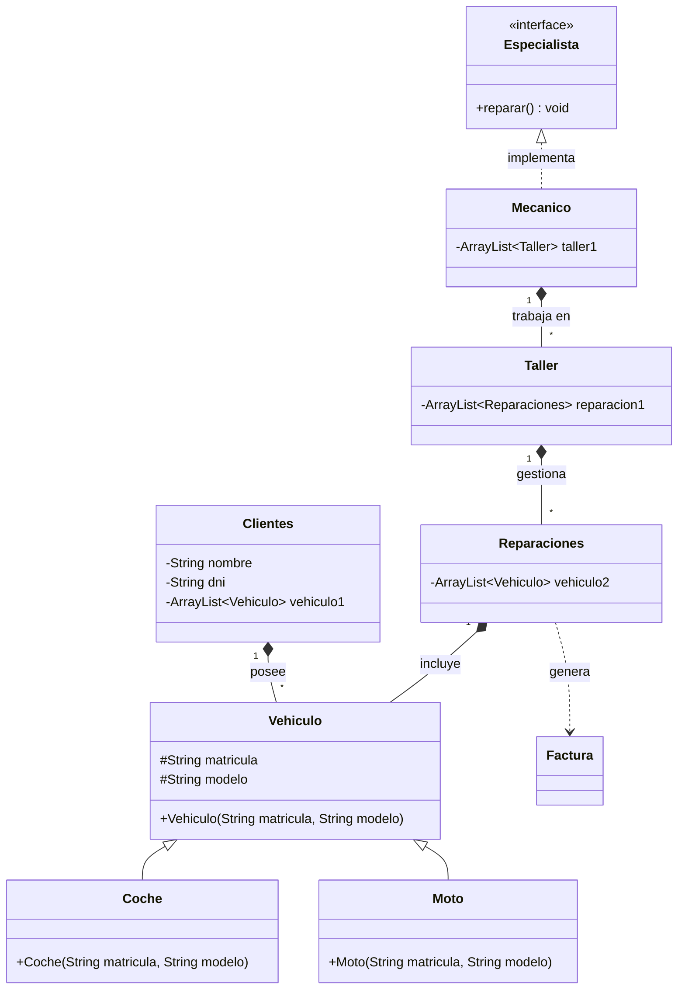

# Ingeniería Inversa
Promt Utilizado:

Quiero que leas mis clases que estan en el packge taller y leas mi Design.md, cuando hagas esto necesito que crees un DESIGN2.md sin tocar nada de lo antiguo que yo ya tenia y dentro de este md hagas un UML usando codigo de mermaid tienes total libertad para dentro de este md hacer el UML que quieras

# Diseño UML del Taller (Versión 2)

A continuación se presenta un diagrama UML elaborado a partir del código de las clases existentes en el paquete `taller`. Este diagrama muestra la estructura de clases del proyecto junto con sus relaciones y atributos visibles, además de algunas sugerencias de relaciones.

### Notas sobre el diseño:
- Se muestra la herencia entre la clase base `Vehiculo` y las especializadas `Coche` y `Moto`.
- Las relaciones de agregación o composición muestran que un **Cliente** tiene vehículos, un **Taller** gestiona una serie de **Reparaciones**, y una **Reparación** incluye vehículos. Un **Mecánico** puede estar asignado a varios talleres.
- Se agregó una conexión sugerida de uso entre `Reparaciones` y `Factura`, además de la implementación sugerida de `Especialista` por parte del `Mecanico`.
